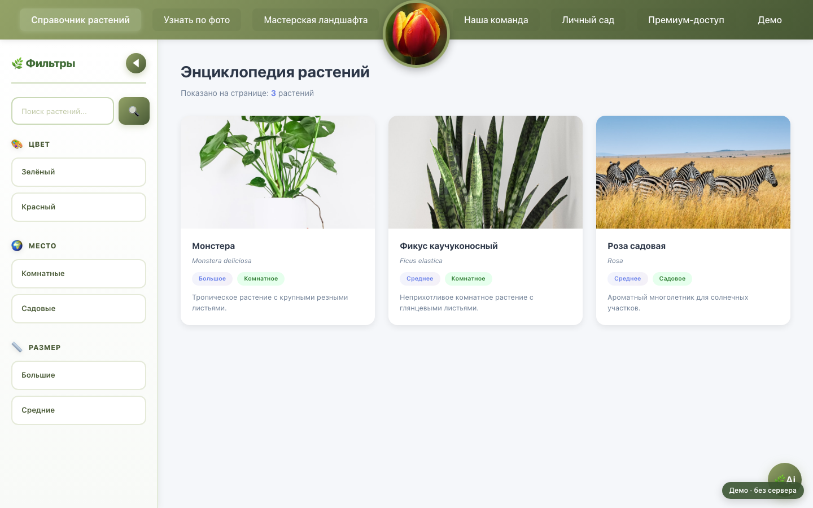

# FloroMate

Веб-приложение для садоводов: справочник растений, распознавание по фотографии,
диагностика заболеваний и визуальное проектирование участка.

[Открыть FloroMate в браузере](https://floro-mate.vercel.app)

[](https://floro-mate.vercel.app)

> Публичная версия запускается в деморежиме и работает без собственного
> бэкенда. Нажмите на изображение или ссылку выше, чтобы открыть приложение.

Проект демонстрирует работу с многостраничным SPA, глобальным состоянием,
защищёнными маршрутами, адаптивным интерфейсом и 3D-графикой.

## Что реализовано

- каталог растений с фильтрацией и подробными карточками;
- загрузка изображений для распознавания растений и заболеваний;
- личный сад и система уровней подписки;
- 2D/3D-конструктор ландшафта;
- авторизация и разграничение доступа к функциям;
- ленивая загрузка страниц и тяжёлого 3D-модуля;
- адаптивная навигация, анимации и состояния интерфейса.

> Интеграции с AI и внешними API требуют ключей доступа. Для локальной
> разработки предусмотрен mock API в `stubs/api`.

## Стек

- React 18, TypeScript, React Router;
- Redux Toolkit;
- Three.js;
- CSS, GSAP и Motion;
- Webpack 5;
- Express для локального mock API.

## Быстрый старт

Потребуются Node.js 22+ и npm 10+.

```bash
npm ci
npm run dev
```

Приложение будет доступно по адресу
`http://localhost:8099`.

По умолчанию приложение запускается в деморежиме без бэкенда. Команда
`npm start` запускает тот же деморежим и автоматически открывает браузер.

### Переключение контуров

```bash
# Демо-контур — используется по умолчанию
npm run dev
npm run dev:demo

# Основной контур — запросы отправляются в реальный API
npm run dev:api
```

Демо-контур автоматически авторизует тестового пользователя с тарифом Pro Ultra,
перехватывает `/api/*` в браузере и использует примеры из
`src/demo/demo-data.json`. Изменения сада сохраняются в `localStorage`.

Для production-сборок:

```bash
# Демо-контур по умолчанию
npm run build:prod
npm run build:demo

# Основной контур с реальным API
npm run build:api
```

Режим также можно выбрать напрямую переменной окружения:
`DEMO_MODE=true` — демо, `DEMO_MODE=false` — реальный API. Для основного
контура `API_BASE_URL` задаёт адрес бэкенда; если оставить его пустым при
локальной разработке, Webpack проксирует `/api` на `http://localhost:3001`.

## Проверка качества

```bash
# проверка TypeScript
npm run typecheck

# production-сборка
npm run build:prod

# обе проверки последовательно
npm run check
```

Результат сборки создаётся в каталоге `dist`.

## Деплой на Vercel

В репозитории есть готовая конфигурация `vercel.json`. Vercel запускает
демо-сборку `npm run build:prod`, публикует каталог `dist` и перенаправляет
SPA-маршруты на `index.html`. Поэтому деплой без дополнительных переменных
работает без бэкенда.

Чтобы развернуть основной контур, замените build-команду на `npm run build:api`
и добавьте переменную:

```text
API_BASE_URL=https://your-api.example.com
```

Укажите публичный адрес отдельно размещённого backend без завершающего `/`.
Локально переменную можно не задавать: Webpack Dev Server проксирует `/api`
на `http://localhost:3001`.

## Переменные окружения

Скопируйте пример конфигурации перед подключением реальных сервисов:

```bash
cp .env.example .env
```

Не добавляйте `.env` и ключи API в репозиторий.

## Структура

```text
src/
├── components/        # переиспользуемые UI-компоненты
├── pages/             # страницы и сценарии приложения
├── store/             # Redux store, hooks и auth slice
├── types/             # общие TypeScript-типы
├── utils/             # бизнес-логика подписок
├── assets/, image/    # изображения и иконки
├── app.tsx            # маршрутизация приложения
└── index.tsx          # точка входа
public/
├── treeModels/        # GLB-модели для 3D-конструктора
└── images3D/          # превью объектов
stubs/api/             # локальный mock API
webpack.config.js      # standalone Webpack-сборка
vercel.json            # настройки деплоя и SPA routing
```

## Архитектурные решения

- Маршруты собраны в `app.tsx`; ограничения доступа инкапсулированы в
  `ProtectedRoute`.
- Состояние пользователя и подписки хранится в Redux Toolkit.
- Проверки тарифов вынесены из компонентов в `subscriptionUtils`.
- Функциональность разнесена по страницам, а повторно используемый UI — по
  компонентам.
- Страницы подключаются через `React.lazy`, поэтому Three.js не увеличивает
  стартовый bundle главной страницы.

## Идеи для развития

- покрыть ключевые пользовательские сценарии Vitest и Testing Library;
- добавить обработку ошибок API и skeleton-состояния;
- заменить демонстрационные уведомления на единый toast-компонент;
- настроить CI с автоматическим запуском `npm run check`.
